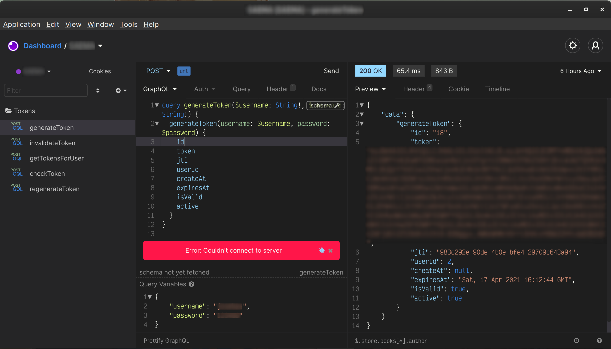

# VSCode for [Insomnia](http://insomnia.rest)

> A dark theme for [Insomnia](http://insomnia.rest)

## Install

All instructions can be found at [Installation instructions](INSTALL.md)

## Support me

 |
:---: |
[Marco Maldonado](https://github.com/mxrck) |

You can [follow me on Twitter](https://twitter.com/_mxrck), [buy me a coffee](https://www.paypal.me/animechannel/5usd) or [support me on Patreon](https://www.patreon.com/user?u=859275)

## License

The MIT License (MIT). Please see [License File](LICENSE.md) for more information.
